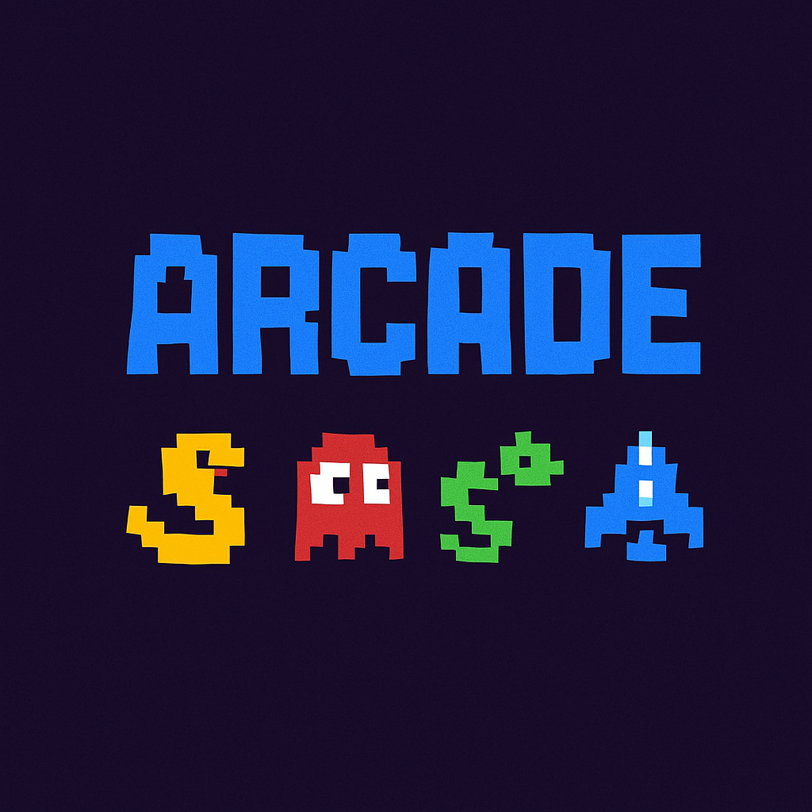

# ARCADE

Un projet de plateforme de jeux rétro où les bibliothèques graphiques et les jeux sont chargés dynamiquement.



## Table des matières
- [Introduction](#introduction)
- [Installation](#installation)
- [Utilisation](#utilisation)
- [Architecture](#architecture)
- [Bibliothèques graphiques](#bibliothèques-graphiques)
- [Jeux](#jeux)
- [Documentation](#documentation)
- [Collaboration](#collaboration)
- [Contributeurs](#contributeurs)

## Introduction

ARCADE est une plateforme de jeu permettant à l'utilisateur de choisir un jeu et une bibliothèque graphique pour l'affichage. Le principe clé du projet est l'utilisation de bibliothèques chargées dynamiquement à l'exécution, permettant une grande flexibilité et extensibilité.

Les différentes bibliothèques graphiques permettent de jouer aux mêmes jeux avec des rendus visuels différents, et la conception modulaire permet d'ajouter facilement de nouveaux jeux et de nouvelles bibliothèques graphiques.

## Installation

### Prérequis
- Compilateur C++ supportant C++17
- Make ou CMake
- Bibliothèques requises:
  - ncurses (en cours de développement)
  - SDL2
  - SFML

### Compilation

#### Avec Make
```bash
# Compiler l'ensemble du projet
make

# Compiler uniquement le core
make core

# Compiler uniquement les jeux
make games

# Compiler uniquement les bibliothèques graphiques
make graphicals

# Nettoyer les fichiers objets
make clean

# Nettoyer les fichiers objets et binaires
make fclean

# Recompiler
make re
```

#### Avec CMake
```bash
mkdir -p build && cd build
cmake .. -G "Unix Makefiles" -DCMAKE_BUILD_TYPE=Release
cmake --build .
cd ..

# Note: Implémentation CMake en cours de développement
```

## Utilisation

Pour lancer l'application, vous devez spécifier une bibliothèque graphique au démarrage:

```bash
./arcade ./lib/arcade_sdl2.so
# ou
./arcade ./lib/arcade_sfml.so
# ou 
./arcade ./lib/arcade_ncurses.so
```

### Contrôles
- **F5**: Changer de bibliothèque graphique (précédente)
- **F6**: Changer de bibliothèque graphique (suivante)
- **Flèche gauche/droite**: Changer de jeu (dans le menu)
- **Flèche haut/bas**: Changer de bibliothèque graphique (dans le menu)
- **Enter**: Lancer le jeu sélectionné
- **R**: Redémarrer le jeu
- **M**: Retourner au menu
- **N**: Modifier le nom d'utilisateur
- **Flèches directionnelles**: Contrôler le jeu
- **Espace**: Action (selon le jeu)
- **Échap**: Quitter

## Architecture

Le projet est structuré autour de trois composants principaux:
1. **Core**: Le programme principal qui gère le chargement des bibliothèques et l'interface utilisateur
2. **Bibliothèques graphiques**: Modules de rendu chargés dynamiquement
3. **Jeux**: Logiques de jeu indépendantes du rendu graphique

### Diagramme de classes simplifié
```
Core
├── DLLoader<T>
├── GameManager
└── DisplayManager

IDisplayModule (Interface)
├── NCursesDisplay (en cours de développement)
├── SDL2Display
└── SFMLDisplay

IGameModule (Interface)
├── Snake
├── Nibbler
└── Pacman
```

## Bibliothèques graphiques

- **NCurses** (`arcade_ncurses.so`): Affichage en mode texte dans un terminal (en cours de développement)
- **SDL2** (`arcade_sdl2.so`): Affichage graphique 2D avec SDL2
- **SFML** (`arcade_sfml.so`): Affichage graphique avec SFML

## Jeux

- **Snake** (`arcade_snake.so`): Jeu du serpent classique
- **Nibbler** (`arcade_nibbler.so`): Variante du Snake dans un labyrinthe
- **Pacman** (`arcade_pacman.so`): Jeu pacman classique

## Documentation

Une documentation complète du projet est disponible sur ce site :

0. [Accueil](https://nogebeat.github.io/doc-arcade/)
1. [Guide de démarrage](https://nogebeat.github.io/doc-arcade/installation.html)
2. [Architecture du Core](https://nogebeat.github.io/doc-arcade/core-arch.html) 
3. [Création d'une nouvelle bibliothèque graphique](https://nogebeat.github.io/doc-arcade/graphics.html)
4. [Création d'un nouveau jeu](https://nogebeat.github.io/doc-arcade/games.html)
5. [API de référence](https://nogebeat.github.io/doc-arcade/api.html)

## Collaboration

Ce projet a été développé en collaboration avec le groupe de [Noge]. Notre collaboration s'est concentrée sur le partage des interfaces des bibliothèques graphiques et des jeux pour assurer la compatibilité entre nos projets.

Contact: [james.gbetchedji@epitech.eu]

## Contributeurs

- **Noge**: [Noge](https://github.com/nogebeat)
- **Christian**: [Nando](https://github.com/nandozinsou)
- **Méryl**: [Méryl](https://github.com/merryl)
